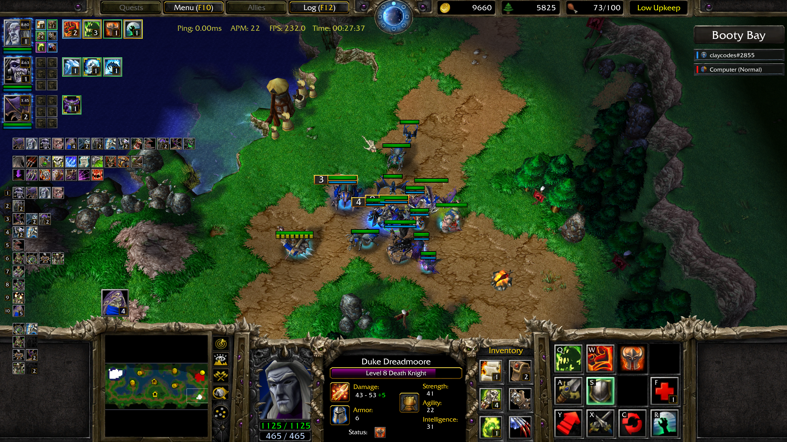

# Warcraft III Overlay for Linux

**Stop guessing cooldowns. See everything that matters, all the time.**

A live HUD that sits on top of Warcraft III: Reforged and shows you exactly what is happening. Your hero's precise level, every cooldown ticking down on the icon itself, every item charge, every control group, every production queue, every player on every team. Updated in real time, drawn straight into the game with Vulkan. No game files are modified. Nothing is injected into the network. Your opponents and the server cannot see it. It is just a HUD on your screen.



## What it does for you in-game

### Your hero, finally readable

- **Exact level to two decimals.** `5.67`, not "around 5". Know to the percent how close you are to that next ult.
- **Cooldowns on the ability icon.** The number ticks down right on top of the spell. No more checking the hero portrait mid-fight to see if Storm Bolt is up.
- **Ability tier color borders that pulse as you level.** Glance and know what tier each spell is at.
- **All six inventory slots** with charges and rarity borders. Tomes, scrolls, potions, wards. See what is there and how much is left without ever opening the inventory.

### The whole game state, always visible

- **Teams.** Every player grouped by their actual team. 1v1, 2v2, FFA, 4v4, weird custom 2v3v2v4 lobbies, anything. Color, race icon, and name for every player.
- **Map name.** Always on screen.
- **Upgrades.** All your finished and in-progress upgrades as icons. No more opening blacksmiths to remember whether you started Iron Plating.
- **All ten control groups.** Composition of each, side by side. See what is in group 4 without pressing 4.
- **Live army by unit type.** Counts for every alive non-building unit, grouped with icons. Know your composition at a glance.
- **Production queues.** Every barracks, every altar, with what is training and a visual indicator that production is actually running.

Every panel can be toggled on or off individually. Live config reload, no game restart needed.

## Disclaimer: Will it get me banned?

Realistically, no. I cannot promise you a hard "never" because it is technically against Blizzard's TOS to read the game's memory or build derivative works on top of it. But similar overlays have been around for years. Popular streamers have used them on stream, in front of thousands of viewers, for entire careers. Some projects in the same space are even monetized and charge money for features that this one gives you for free. Across all of that, I have not heard of a single person getting banned for using one.

The overlay does not read anything you are not already supposed to see. No fog-of-war peeking, no opponent hero levels, no opponent build orders, no opponent inventory. Every detail it shows is information you already have on your own screen, just made glanceable instead of buried in a portrait or behind a hotkey. There is no anti-cheat hook in Warcraft III that can detect it, nothing leaves your machine, and Blizzard has shown no interest in chasing tools like this in the past.

So the honest answer is: technically possible, practically not a thing that happens. If Blizzard one day decides to care, that calculus could change, and you are running it at your own risk. But the track record so far is years of these tools existing in the open with no consequences.

## Get it running

You need Warcraft III working on Linux first. If you have not done that, follow the [W3Champions on Linux guide](https://github.com/clemenscodes/W3ChampionsOnLinux) and come back when the game launches.

### 1. Install

```sh
git clone https://github.com/clemenscodes/warcraft-vulkan-overlay
cd warcraft-vulkan-overlay
./install.sh
```

You should see:

```
Installation complete.
```

### 2. Flip the switch

The overlay is installed but invisible until you turn it on. Add `WARCRAFT_OVERLAY_ENABLE=1` to whatever you use to launch the game. Think of it as a switch you flip before launch.

**From a terminal:**

```sh
WARCRAFT_OVERLAY_ENABLE=1 wine "$HOME/Games/W3Champions/drive_c/Program Files/W3Champions/W3Champions.exe"
```

**From Lutris:**

1. Right-click the game → Configure → System options.
2. Scroll to Environment variables and click +.
3. Key: `WARCRAFT_OVERLAY_ENABLE`, Value: `1`.
4. Save and launch the game as usual.

That is it. Boot the game and the HUD is there.

## Customize it

After the first run, the overlay creates `~/.config/warcraft-overlay/config.toml`. Open it in any text editor and toggle things on or off:

```toml
control_groups         = true
hero_abilities         = true
hero_ability_borders   = true   # colored rarity border on ability icons
hero_ability_levels    = true   # level number badge on ability icons
hero_inventory         = true
hero_inventory_borders = true   # colored rarity border on item icons
hero_level             = true
icons_per_row          = 10     # abilities and upgrades wrap after this many icons (5 to 20)
map                    = true
queues                 = true
teams                  = true
units                  = true
upgrades               = true
```

**Live reload.** Save the file and the overlay picks up the change within a few seconds. No restart.

If you would rather drive it from your launcher, every option also has a matching environment variable. Set to `0` to disable, `1` to enable. Env vars take priority over the config file.

| Panel                  | Environment variable                      |
| ---------------------- | ----------------------------------------- |
| Control groups         | `WARCRAFT_OVERLAY_CONTROL_GROUPS`         |
| Hero abilities         | `WARCRAFT_OVERLAY_HERO_ABILITIES`         |
| Hero ability borders   | `WARCRAFT_OVERLAY_HERO_ABILITY_BORDERS`   |
| Hero ability levels    | `WARCRAFT_OVERLAY_HERO_ABILITY_LEVELS`    |
| Hero inventory         | `WARCRAFT_OVERLAY_HERO_INVENTORY`         |
| Hero inventory borders | `WARCRAFT_OVERLAY_HERO_INVENTORY_BORDERS` |
| Hero level             | `WARCRAFT_OVERLAY_HERO_LEVEL`             |
| Icons per row          | `WARCRAFT_OVERLAY_ICONS_PER_ROW`          |
| Map                    | `WARCRAFT_OVERLAY_MAP`                    |
| Queues                 | `WARCRAFT_OVERLAY_QUEUES`                 |
| Teams                  | `WARCRAFT_OVERLAY_TEAMS`                  |
| Units                  | `WARCRAFT_OVERLAY_UNITS`                  |
| Upgrades               | `WARCRAFT_OVERLAY_UPGRADES`               |

## Streaming on OBS

Two ways to capture the game.

**Easy way.** Use a Screen Capture or Window Capture source. The overlay is drawn into the game window, so it shows up automatically. Nothing to configure.

**Better way (lower latency, GPU-direct).** Install the [obs-vkcapture plugin](https://github.com/nowrep/obs-vkcapture), add a Game Capture source, and add `OBS_VKCAPTURE=1` to your game launch alongside `WARCRAFT_OVERLAY_ENABLE=1`:

```sh
WARCRAFT_OVERLAY_ENABLE=1 OBS_VKCAPTURE=1 wine "$HOME/Games/W3Champions/drive_c/Program Files/W3Champions/W3Champions.exe"
```

In Lutris, add both as environment variables. The HUD will show up in the recording as long as the overlay was installed with `install.sh` (it has to be registered as an _implicit_ Vulkan layer, which the script does automatically).

## When something is wrong

### The overlay does not show up

99% of the time, `WARCRAFT_OVERLAY_ENABLE=1` did not actually reach the game. Double-check it:

- Terminal: it has to be at the very start of the wine command, before the word `wine`.
- Lutris: it has to be in the game's own System options under Environment variables, not somewhere else in Lutris.

If that is set correctly, verify the install:

```sh
ls ~/.local/share/vulkan/implicit_layer.d/
```

You should see `VkLayer_warcraft_overlay_linux.json` and `libVkLayer_warcraft_overlay.so`. If they are missing, run `./install.sh` again.

### The overlay went dark after a game patch

Each overlay release targets exactly one Warcraft III version. If Blizzard ships a patch, the overlay refuses to render rather than read the wrong memory and show garbage.

Wait for a new release, or grab the older release matching your game version from the [releases page](https://github.com/clemenscodes/warcraft-vulkan-overlay/releases) and install it manually:

```sh
LAYER_DIR="$HOME/.local/share/vulkan/implicit_layer.d"
install -m 644 VkLayer_warcraft_overlay_linux.json "$LAYER_DIR/"
install -m 755 libVkLayer_warcraft_overlay.so      "$LAYER_DIR/"
```

### The game gets stuck at the lion doors

This is a Wine or DXVK problem. See the [W3Champions on Linux guide](https://github.com/clemenscodes/W3ChampionsOnLinux).

### OBS does not capture the HUD

- Screen capture: make sure the overlay is actually visible in-game first.
- Swapchain capture: `OBS_VKCAPTURE=1` goes on the _game_ launch command, not on OBS. And the overlay has to be an implicit layer, which `install.sh` handles. Manual installs as explicit layers will not capture.

### Something else

Run the game from a terminal with extra logging on and look for errors:

```sh
WARCRAFT_OVERLAY_ENABLE=1 VK_LOADER_DEBUG=error DXVK_LOG_LEVEL=warn wine "$HOME/Games/W3Champions/drive_c/Program Files/W3Champions/W3Champions.exe"
```

Paste the output into a [GitHub issue](https://github.com/clemenscodes/warcraft-vulkan-overlay/issues).

## Versioning

One release per Warcraft III version. The release tag is the game version it was built for (e.g. `2.0.4.23745`). When Blizzard patches the game, a new build goes out under the new version tag once memory offsets are updated.

## Advanced

Skip this unless `install.sh` did not work for you, or you use Nix.

### Windows (experimental)

Technically possible, but not yet confirmed working. The overlay only renders when Warcraft III presents through Vulkan, which on Windows means running the game through DXVK instead of native Direct3D. That setup has not been verified yet. The Windows binary (`VkLayer_warcraft_overlay.dll`) ships anyway so it is ready when someone sorts it out. If you get it working, please open an issue with the steps.

### Nix (home-manager, recommended on NixOS)

The flake ships a home-manager module that symlinks the layer into `~/.local/share/vulkan/implicit_layer.d/`:

```nix
# flake.nix inputs
inputs.warcraft-vulkan-overlay.url = "github:clemenscodes/warcraft-vulkan-overlay";

# home.nix
imports = [ inputs.warcraft-vulkan-overlay.homeManagerModules.default ];
warcraft.overlay.enable = true;
```

Rebuild your home configuration, then set `WARCRAFT_OVERLAY_ENABLE=1` when launching the game as in Step 2.

### Nix (dev shell)

The flake also exposes a dev shell that pulls in `wine`, `winetricks`, and the overlay, with all required environment variables (including `WARCRAFT_OVERLAY_ENABLE=1`) preset:

```sh
nix develop github:clemenscodes/warcraft-vulkan-overlay
wine "$W3C"
```

`$W3C` points to the W3Champions launcher in the default Wine prefix at `$HOME/Games/W3Champions`. Adjust if yours is elsewhere.

### Manual install

Grab `libVkLayer_warcraft_overlay.so` and `VkLayer_warcraft_overlay_linux.json` from the latest [release](https://github.com/clemenscodes/warcraft-vulkan-overlay/releases):

```sh
LAYER_DIR="$HOME/.local/share/vulkan/implicit_layer.d"
mkdir -p "$LAYER_DIR"
install -m 644 VkLayer_warcraft_overlay_linux.json "$LAYER_DIR/"
install -m 755 libVkLayer_warcraft_overlay.so      "$LAYER_DIR/"
```

Then set `WARCRAFT_OVERLAY_ENABLE=1` when launching the game.
